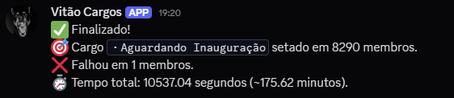

# vh_discordbot_setrole

Bot de Discord projetado para atribuir um cargo a milhares de membros com alta performance e controle sobre os limites da API do Discord.

## ✨ Destaques
- Processamento em batches de 30 membros
- Delay controlado de 3.33s para operar com 9 requisições por segundo (seguro)
- Logs de progresso a cada 1000 membros
- Cálculo e exibição do tempo total de execução

## 🌊 Caso de uso
Este bot foi utilizado no servidor oficial do **Brasil Mundo Real (BMR)** para atribuir um cargo a **11.867 membros** ativos, com segurança total e sem interrupções.

### 📈 Log do bot em execução


### 📊 Mensagem final no Discord


### 👥 Cargo aplicado com sucesso a 11.863 membros


---

## 🔧 Instalação

1. Clone o repositório:
```bash
git clone https://github.com/euvhmac/vh_discordbot_setrole.git
cd vh_discordbot_setrole
```

2. Crie o ambiente virtual (opcional, mas recomendado):
```bash
python -m venv venv
venv\Scripts\activate  # Windows
```

3. Instale as dependências:
```bash
pip install -r requirements.txt
```

4. Crie um arquivo `.env` com o token do bot:
```env
TOKEN_DISCORD=seu_token_aqui
```

5. Rode o bot:
```bash
python bot.py
```

## 📃 Licença
Este projeto é distribuído com fins educacionais e operacionais internos. O uso em larga escala é de responsabilidade do operador.

---

Desenvolvido com foco em performance, estabilidade e controle absoluto. Qualquer dúvida ou sugestão, abra uma issue ou entre em contato.

